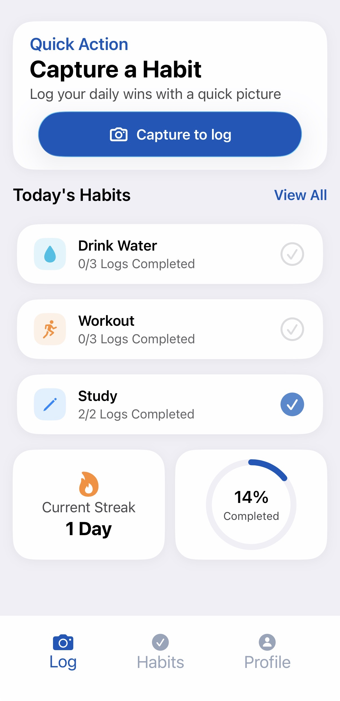
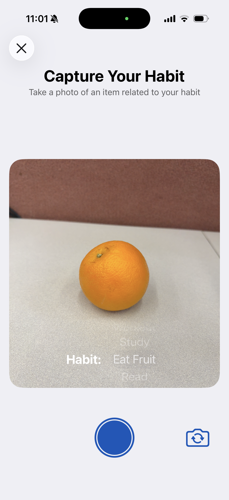
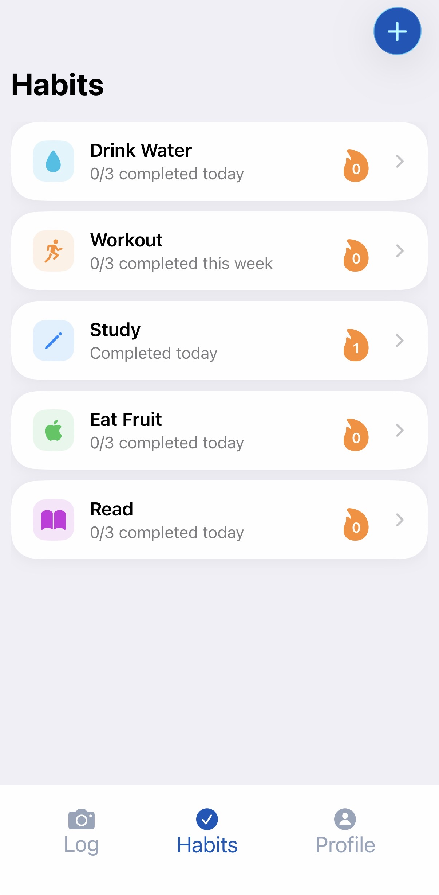

# Proofly

## Summary
An iOS app that helps users build daily habits using photo verification and AI image labeling. Users capture images of actions (e.g. studying, drinking water), which are analyzed and logged to track consistency and progress over time.

## Technologies Used
- SwiftUI (iOS frontend)
- Node.js / Express (backend API)
- Firebase Authentication
- Firebase Firestore
- Firebase Storage
- Cloud Vision API (image labeling)
- Alamofire API Requests
- AVFoundation Camera Integration

## Screenshots

## Demo Video
[Watch Demo](YOUR_YOUTUBE_LINK)
